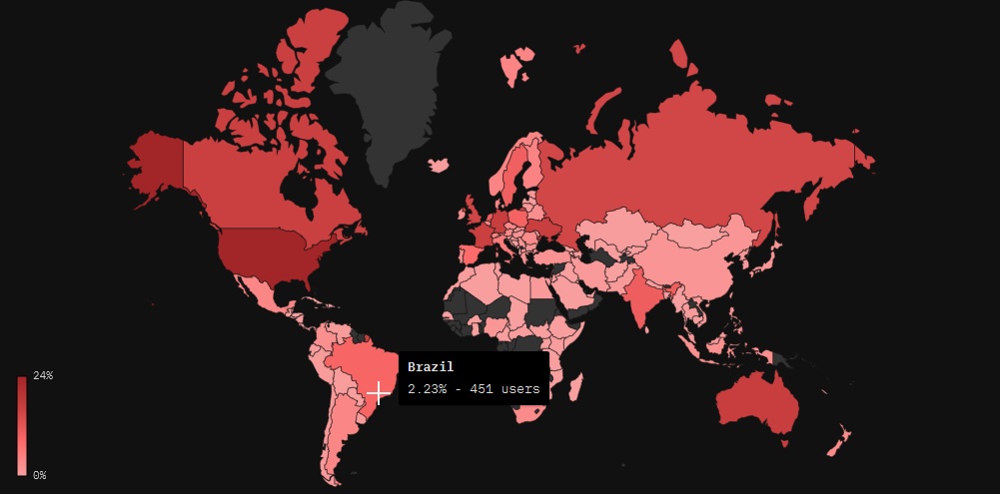
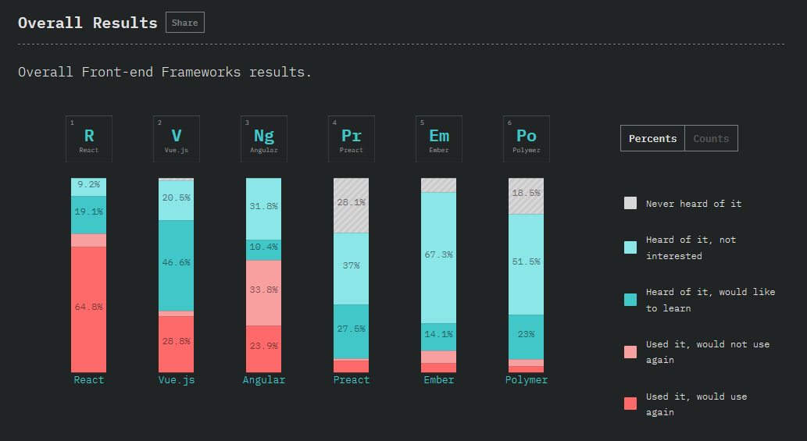
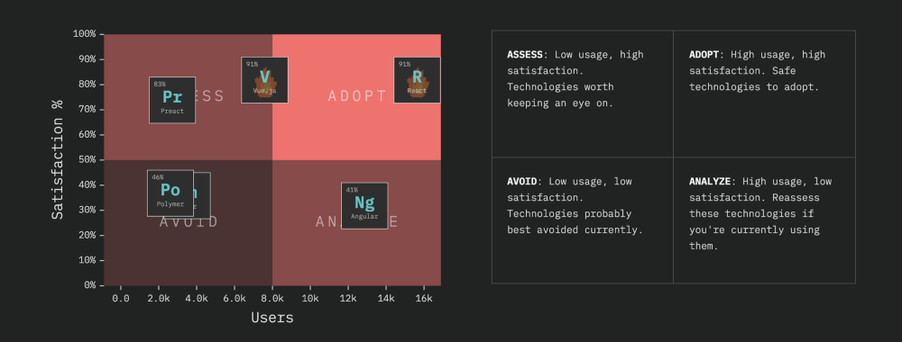
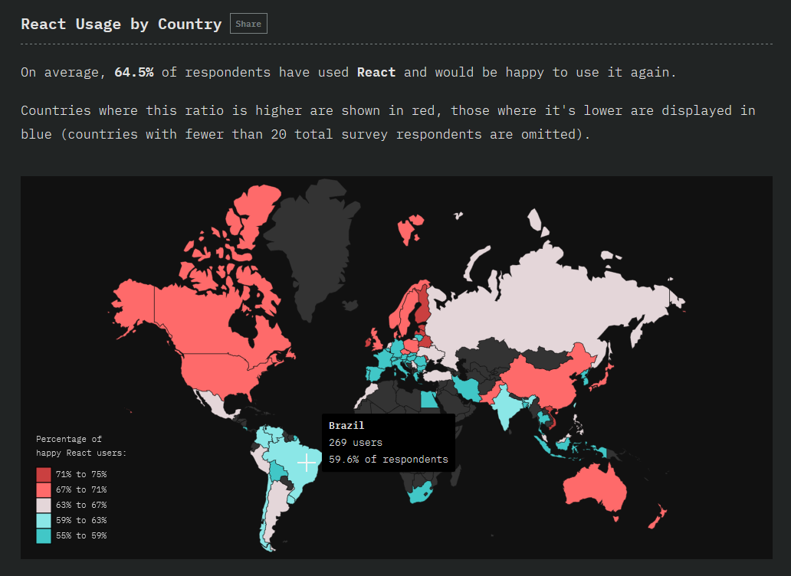
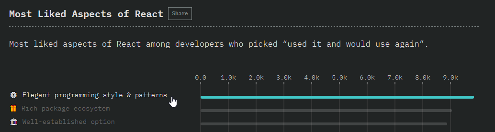
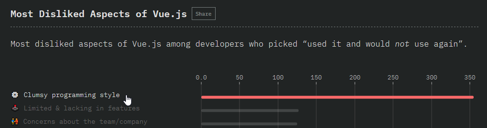
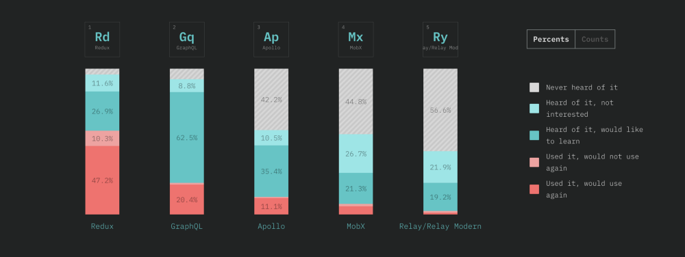
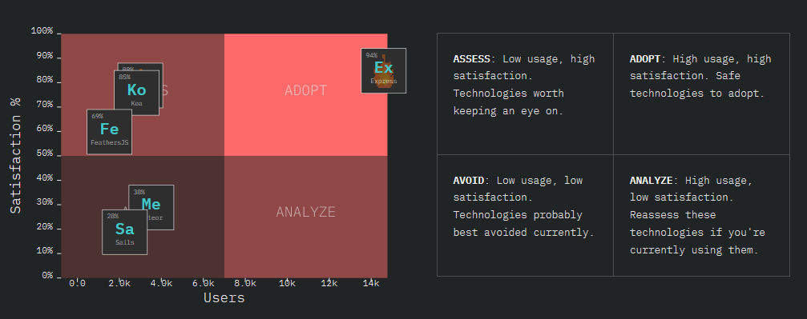
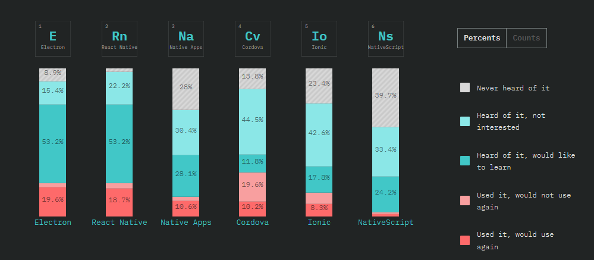
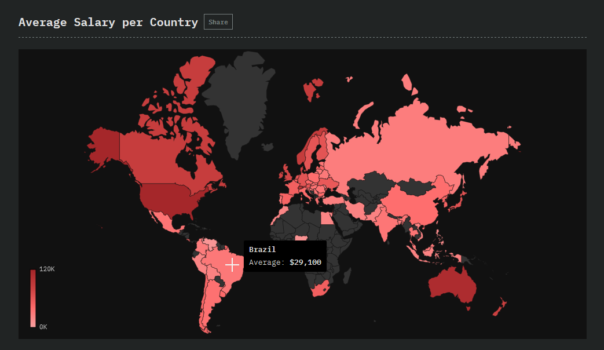

Há pouco tempo saiu o resultado do
[State of JavaScript](https://2018.stateofjs.com/), uma pesquisa com 20+ mil
desenvolvedores sobre como anda o JavaScript. Foi perguntado sobre seus usos,
satisfação e sobre o que querem aprender. A pesquisa começou em 2016 e, apesar
de muito nova, já mostra um gráfico de evolução da linguagem e como cresceu em
popularidade.

A pesquisa chegou em 153 países, com representação maior dos EUA com 24% dos
resultados, seguidos da Alemanha e Austrália, com pouco mais de 5%. O Brasil
ficou com 2,23% ou 451 pessoas. Entretanto, pelo site e a pesquisa ser todo em
inglês, existe uma óbvia barreira na língua. Isso é sabido pela equipe da
pesquisa e
[estão pedindo ajuda](https://github.com/StateOfJS/StateOfJS/issues/87). Se você
acha que pode ajudar na trdução, essa é uma ótima porta de entrada pra ajudar a
comunidade de código aberto (ou open source ou OSS - difícil de traduzir, parte
2).

## Objetivo do post

Além de traduzir algumas partes do
[anúncio original](https://medium.freecodecamp.org/the-state-of-javascript-2018-8322bcc51bd8),
quis focar nos resultados sobre a realidade do Brasil. Exemplo: Ano passado eu
usava os dados pra mostrar como o Brasil ainda tinha procura e demanda de
AngularJS e o que isso representava ao país. Como esse ano o framework saiu da
pesquisa, não pude mais fazer a comparação.

Mesmo com esses dados, a amostragem é muito pequena, então temos que tomar muito
cuidado ao tomar como verdade. Alguns comentários que faço não levam isso em
consideração, então tome cuidado ao levar adiante.

## Tem um resumo?

Os dados já são um resumo e não tem tanto dado assim pra se perder. Nesse post
tentei ser o mais suscinto possível!

Algumas coisas não mudaram. A popularidade da linguagem continua subindo. O
[framework mais usado continua sendo React](https://2018.stateofjs.com/front-end-frameworks/overview/)
. Nesse ano analisaram também a satisfação das pessoas com
as ferramentas usadas e React está [no maior nível de satisfação por uso](https://2018.stateofjs.com/front-end-frameworks/conclusion/).
Vue está chegando lá, mas Angular, apesar de bem usado tem um nível de
satisfação baixo. Suspeitam que a confusão dos nomes, AngularJS e Angular seja
um dos fatores pra essa baixa satisfação. Já estamos em 2018 e ainda acontece
essa confusão. Nunca mais hein, Google? 😉

## Sabores

TypeScript
[continua no topo](https://2018.stateofjs.com/javascript-flavors/overview/),
depois de ES6. Flow deu uma grande caída e o nível de satisfação também não é
dos melhores.

O Brasil tem um nível de satisfação elevadíssimo com TypeScript, quase 50% dos
usuários responderam que usaram e usariam novamente. Flow está numa média de 10%
apenas mundialmente.

Na minha opinião, ES6 devia ser retirado da pesquisa, afinal já se passaram anos
desde que entrou ES6 e sua adoção é inevitável. Afinal, a única coisa que daria
pra comparar com ele seria uma versão mais antiga de
[ECMAScript](https://medium.com/trainingcenter/afinal-javascript-e-ecmascript-s%C3%A3o-a-mesma-coisa-498374abbc47).

## Frameworks

Uma coisa que me chamou a atenção é que esse ano React ganhou também no Brasil,
com quase 60% dos usuários dizendo que já usaram e usariam novamente. Apesar do
gráfico ser um pouco enganoso, existem mais usuários de React do que de outros
frameworks por aqui (269 contra 171 de Vue ou 135 de Angular). Ano passado ele
também havia ganhado, mas Angular estava muito próximo e quem se aproxima mais
agora é o Vue!

Outro dado interessante é que quem
usa [React](https://2018.stateofjs.com/front-end-frameworks/react/)
gosta dele pelo "Estilo e padrões elegantes de se programar" e quem já usou mas
não voltaria a usar pelo seu exato oposto, acha ele "Jeito de programar
desajeitado". [Em Vue](https://2018.stateofjs.com/front-end-frameworks/vuejs/),
o consideram "Fácil de aprender", porém pros que não usariam de novo está no
"Jeito de programar desajeitado" com uma **_distância enorme_** da segunda
opção (350+ vs 120~).
[Pra Angular](https://2018.stateofjs.com/front-end-frameworks/angular/) o
consideram "Cheio de Recursos" (ou "Mais Completo"), mas pra quem não usuaria
mais o consideram "Muito intenso e complexo".

## Camada de Dados

Nos resposáveis pela camada de dados, Redux, GraphQL e Apollo estão no topo.
Esse é um dado difícil de comparar entre si, afinal Redux e GraphQL tem pouco a
ver um com o outro, mas é interessante saber o quão usado estão. GraphQL
praticamente dobrou no número de usuários nessa versão enquanto Redux
permaneceu muito próximo de onde estava, mas com um nível de satisfação enorme.

## Restante da pesquisa

Meu foco principal é frontend, então tendo a passar mais específicos sobre eles.
De qualquer maneira, achei interessante pautar sobre o restante também só pra
não deixar passar.

Em backend, o mais usado ainda é Express. Mesmo com tantos frameworks saindo,
nada se compara ao nível de satisfação e uso do
[Express](https://expressjs.com/). Nota-se também que
[Nextjs](https://nextjs.org/) cresceu bastante comparado ao último ano.

Nas ferramentas de teste, Jest tem o maior nível de satisfação, porém Mocha tem
o maior número de usuários. Vale a pena notar que esse nível de satisfação do
Jest (96%) é o maior de toda pesquisa, se não contarmos com ES6.

Já entre as ferramentas para fazer apps em celular e desktop, Electron foi a
mais conhecida e usada, muito próximo da segundo colocada React Native. Outros
grandes nomes estão no mesmo gráfico como Cordova, Ionic e NativeScript.
Interesante também é saber que o nível de satisfação com Cordova é o pior,
chegando em 14%.

## Outras ferramentas de interesse

- Outra linguagem: [Python](https://www.python.org/)
- API do Navegador:
  [Service Workers](https://developer.mozilla.org/en-US/docs/Web/API/Service_Worker_API)
  e
  [Progressive Web Apps](https://developers.google.com/web/progressive-web-apps/)
- Build tools: [Webpack](https://webpack.js.org/)
- Bibliotecas utilitárias: [lodash](https://lodash.com/) e
  [moment](https://momentjs.com/)
- Editor de Texto: [vscode](https://code.visualstudio.com/) 😮

Me impressiona como a Microsoft acertou com o Visual Studio Code!

## Salários

A [faixa salarial](https://2018.stateofjs.com/demographics/salary-per-country)
é outro ponto que me surpreende todo ano. A média brasileira anual pra um
desenvolvedor é de 110 mil reais, já a americana é de mais de 400 mil. O Brasil
fica abaixo de países como a China, Índia e Argentina na pesquisa.

No entanto, a diferença pros países com maior salário é brutal. Não é a toa que
tantos brasileiros da área querem sair do país.

## Tecnicalidades: ferramentas da pesquisa

Usaram [Typeform](https://www.typeform.com/) pra fazer a pesquisa, normalizaram
o resultado com [ElasticSearch](https://www.elastic.co/), ligaram esses dados
JSON no [Gatsby](https://www.gatsbyjs.org/) pra gerar o site e finalmente,
usaram o [Nivo.js](https://nivo.rocks/) pra fazer os gráficos.

O projeto inteiro está
[disponível no GitHub](https://github.com/StateOfJS/StateOfJS/tree/master/surveys/2018)
se quiser aprender mais.

## Mais pesquisas

### [Pesquisa do NPM](https://buff.ly/2FUS29H)

Existe uma outra pesquisa formada pela equipe do NPM que vale a pena participar.
Ano passado foram 16+ mil participantes. Separe uns 10 minutos do seu dia pra ir
lá representar nosso país!

### [Pesquisa do NodeJS](https://nodejs.org/en/user-survey-report/)

No começo desse ano, o [nodejs](https://nodejs.org) também postou uma pesquisa
feita entre Outubro de 2017 até Janeiro desse ano. Teve participação de 1626
pessoas e é bem focado no perfil do usuário node. O mais interessante: 7% dos
usuários são da américa do sul e 4% são falantes de português. Parece pouco, mas
em comparação com outras regiões e línguas não é nada mal.

## Concluindo

JavaScript é a linguagem de programação mais usada do mundo. Muita gente odeia,
muita gente gosta, mas isso é um fato. Essa pesquisa ajuda a saber as tendências
da linguagem e qual direção está seguindo. A satisfação dos usuários da pesquisa
em geral cresceu em relação a 2016 pra 2017 e é muito importante que o Brasil
participe mais. Com o brasileiro participando mais, o jeito que olham o
desenvolvedor brasileiro melhora, agregamos mais valor às empresas com um
argumento mais fácil de digerir e ouso a dizer, melhora nossa auto estima.

Obrigado pela visita e até a próxima! 😄

---

**_Nota de tradução_**
Não sou maior fã de traduzir **State** pra **Estado**, mas é difícil de traduzir
sem mudar completamente o título. Uma tradução que me veio a cabeça que encaixa
bem era **"Como está o JavaScript?"**, mas acabei deixando essa que é mais
próxima do literal.
