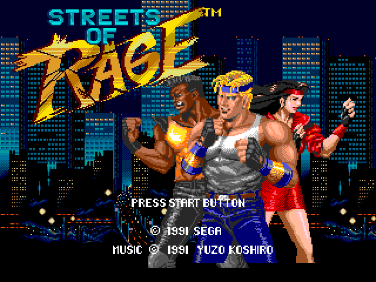

Consegui fazer um novo tema, algo que estava guardado no meu PC há muito tempo.
É muito mais escuro, divertido e com muita personalidade.

## Insipirações e referências

O logo e o rodapé são de referência ao jogo
[Streets of Rage](https://pt.wikipedia.org/wiki/Streets_of_Rage) de
[Genesis/Mega Drive](https://pt.wikipedia.org/wiki/Mega_Drive). Eu curtia o tema
antigo, refinei ele bastante, mas no fim esse aqui diz muito mais sobre mim que
o anterior.

## Próximos passos

Irei dar mais destaque aos meus dados que por enquanto seguem o layout antigo.
Também quero brincar mais com os pixels do céu no topo e adicionar uma barra de
vida com meu avatar (e um link pro [meu twitter](https://twitter.com/bsides)).

Também quero atualizar as versões de tudo que já estão super antigas.

## Sugestões?

O que achou? Me envie sua opinião ou sugestão via
[twitter](https://twitter.com/bsides) ou veja
[esse post](/2018-12-03-primeiro-post) (dê scroll até o fim) pra ver outras
opções!
